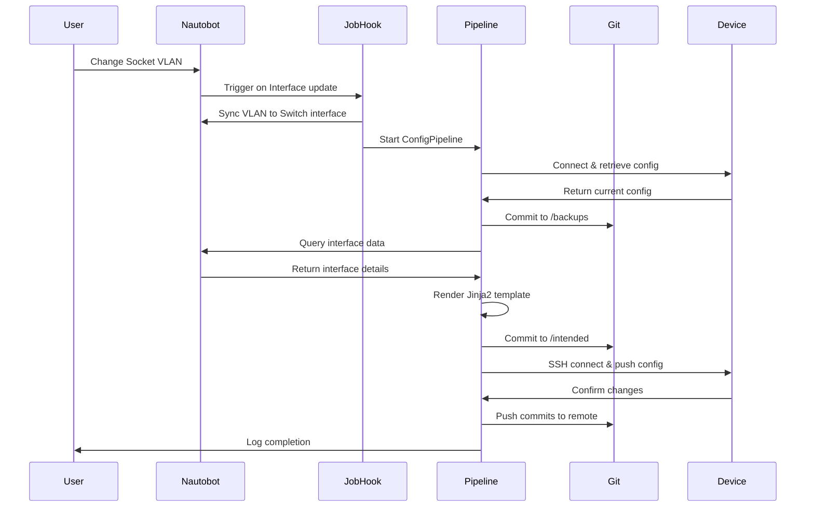

# Network Configuration Automation PoC

> **Automated VLAN provisioning and configuration management using Nautobot as the Source of Truth**

[](https://nautobot.com)
[](https://www.juniper.net)
[](https://www.python.org)

---

## 📋 Table of Contents

- [Overview](#overview)
- [Use Case](#use-case)
- [Architecture](#architecture)
- [Repository Structure](#repository-structure)
- [Pipeline Workflow](#pipeline-workflow)
- [Prerequisites](#prerequisites)
- [Installation](#installation)
- [Configuration](#configuration)
- [Usage](#usage)
- [Extending the PoC](#extending-the-poc)
- [Troubleshooting](#troubleshooting)
- [Contributing](#contributing)
- [License](#license)

---

## 🎯 Overview

This repository contains a **Proof of Concept (PoC)** for automated network configuration management using **Nautobot** as the central Source of Truth. The system automatically synchronizes VLAN changes from customer-facing Socket interfaces to their connected Switch ports, then pushes the configuration to physical/virtual network devices.

### Key Features

✅ **Bidirectional Sync** - Automatic VLAN synchronization between Socket and Switch interfaces  
✅ **GitOps Workflow** - All configurations version-controlled in Git  
✅ **Backup Safety** - Device configs backed up before any changes  
✅ **Intended State** - Configuration generated from Nautobot data via Jinja2 templates  
✅ **Automated Push** - Changes automatically deployed to devices  
✅ **Audit Trail** - Complete history of changes tracked in Git commits  

---

## 💡 Use Case

### Business Problem

**Traditional Workflow for Customer VLAN Changes in a Business Park:**

When a customer in the business park needs a VLAN change on their Socket (customer-facing port), the process is painful:

1. Customer contacts support via ticket/email/phone
2. Network engineer receives request
3. Engineer must find which Switch port the Socket connects to:
   - Manually trace physical cabling in the datacenter 🔌
   - Check Excel spreadsheet documentation (if it exists and is current)
   - Look up patching info in management tools like Omnivista
   - Hope the documentation is actually correct
4. Engineer manually SSH into the switch
5. Engineer manually configures the interface
6. Engineer updates documentation (maybe)
7. Engineer notifies customer (hours or days later)

**Problems:**
- ❌ Slow turnaround (hours to days)
- ❌ Documentation often outdated or wrong
- ❌ Manual cabling verification required
- ❌ Error-prone manual configuration
- ❌ No self-service for customers
- ❌ High operational overhead

### Solution: Customer Self-Service with Automation

This PoC enables **customer self-service** through Nautobot's permission system:

```
Customer logs into Nautobot (restricted access)
         ↓
Customer sees ONLY their Socket interface
         ↓
Customer changes VLAN via web UI
         ↓
JobHook automatically detects change
         ↓
Switch interface VLAN synced in Nautobot automatically
         ↓
Pipeline triggered automatically:
  ├─ Backup current device config
  ├─ Generate intended config from Nautobot
  └─ Push config to physical device
         ↓
Customer VLAN is live within seconds ✅
```

**Result:** 
- ✅ Self-service for customers (24/7 availability)
- ✅ Instant provisioning (seconds instead of hours/days)
- ✅ No manual cabling verification needed (Nautobot is the Source of Truth)
- ✅ Zero manual device configuration
- ✅ Full audit trail in Git
- ✅ Documentation always current (Nautobot + Git)

**The Key:** Nautobot knows the Socket ↔ Switch mapping through cable connections, eliminating the need for Excel sheets or manual verification!

---

## 🏗️ Architecture

### Component Diagram

```
┌─────────────────────────────────────────────────────────────────┐
│                         NAUTOBOT                                │
│                    (Source of Truth)                            │
│                                                                 │
│  ┌──────────────┐         ┌──────────────┐                    │
│  │   Socket     │◄───────►│    Switch    │                    │
│  │  Interface   │  Sync   │  Interface   │                    │
│  │  (Customer)  │         │  (Uplink)    │                    │
│  └──────────────┘         └──────────────┘                    │
│         │                         │                            │
│         │    JobHook Trigger      │                            │
│         └─────────┬───────────────┘                            │
│                   ▼                                             │
│         ┌─────────────────────┐                                │
│         │  Config Pipeline    │                                │
│         │  Orchestrator Job   │                                │
│         └─────────────────────┘                                │
│                   │                                             │
└───────────────────┼─────────────────────────────────────────────┘
                    │
        ┌───────────┼───────────┐
        ▼           ▼           ▼
    ┌───────┐  ┌────────┐  ┌──────┐
    │Backup │  │Intended│  │ Push │
    │ Job   │  │  Job   │  │ Job  │
    └───┬───┘  └───┬────┘  └──┬───┘
        │          │           │
        ▼          ▼           ▼
    ┌──────────────────────────────┐
    │      Git Repository          │
    │  /backups  /intended         │
    └──────────────────────────────┘
                   │
                   ▼
            ┌─────────────┐
            │   Device    │
            │  (vJunOS)   │
            └─────────────┘
```

### Data Flow

1. **Trigger**: User changes VLAN on Socket interface in Nautobot
2. **Sync**: JobHook detects change and syncs VLAN to Switch interface
3. **Backup**: Current device config retrieved and saved to `/backups`
4. **Intended**: Desired config rendered from Nautobot data to `/intended`
5. **Push**: Configuration commands sent to device via SSH (Netmiko)
6. **Commit**: All changes tracked in Git with commit messages

---

## 📁 Repository Structure

```
poc_netops/
├── README.md                          # This file
├── .git/                              # Git version control
├── .gitignore                         # Git ignore rules
│
├── backups/                           # Device configuration backups
│   ├── switch01.set                   # Backup in Junos "set" format
│   └── switch02.set                   # One file per device
│
├── intended/                          # Intended (desired) configurations
│   ├── switch01.conf                  # Generated from Nautobot + template
│   └── switch02.conf                  # What the device SHOULD look like
│
├── templates/                         # Jinja2 templates
│   └── juniper_junos.j2               # Template for Junos configuration
│
└── jobs/                              # Nautobot job definitions
    ├── __init__.py
    ├── sync_socket_job.py             # JobHook: Socket↔Switch VLAN sync
    ├── config_pipeline_job.py         # Main orchestrator
    ├── backup_config_job.py           # Step 1: Backup device config
    ├── intended_config_job.py         # Step 2: Build intended config
    └── push_config_job.py             # Step 3: Push config to device
```

### Directory Purposes

| Directory | Purpose | Generated By |
|-----------|---------|--------------|
| `/backups` | Current device configurations in "set" format | Backup job or Golden Config plugin |
| `/intended` | Desired configurations rendered from Nautobot | Intended job or Golden Config plugin |
| `/templates` | Jinja2 templates for config generation | Manual (version controlled) |
| `/jobs` | Nautobot job definitions (Python) | Manual (version controlled) |

---

## 🔄 Pipeline Workflow

### Automatic Execution Flow



### Step-by-Step Breakdown

#### **Step 0: JobHook Trigger** (`sync_socket_job.py`)

- Listens for Interface updates in Nautobot
- Detects Socket ↔ Switch connections
- Syncs untagged VLAN bidirectionally
- Triggers pipeline if changes made

#### **Step 1: Backup** (`backup_config_job.py`)

```bash
# What happens:
SSH to device → Run "show configuration | display set"
                ↓
Save to /backups/<device>.set
                ↓
Git commit: "Backup config for device switch01"
```

**Purpose:** Safety net for rollback if something goes wrong

#### **Step 2: Intended Config** (`intended_config_job.py`)

```bash
# What happens:
Query Nautobot for device interfaces
                ↓
Render /templates/juniper_junos.j2 with data
                ↓
Save to /intended/<device>.conf
                ↓
Git commit: "Update intended config for device switch01"
```

**Purpose:** Generate "should-be" state from Source of Truth

#### **Step 3: Push Config** (`push_config_job.py`)

```bash
# What happens:
Render template for specific interface
                ↓
Generate Junos "set" commands
                ↓
SSH to device → send_config_set()
                ↓
Device applies configuration
```

**Purpose:** Make reality match the intended state

#### **Step 4: Git Push** (`config_pipeline_job.py`)

```bash
# What happens:
Git push to remote repository
                ↓
Sync all commits to central server
```

**Purpose:** Team visibility and backup

---

## 📦 Installation

### 1. Clone Repository

```bash
# On Nautobot server
cd /opt/nautobot/
git clone <repository-url> git/poc_netops
cd git/poc_netops
```

### 2. Set Environment Variable

```bash
# Add to Nautobot environment (e.g., ~/.bashrc or systemd unit file)
export POC_NETOPS_REPO="/opt/nautobot/git/poc_netops"

# Optional: Fallback credentials
export NETMIKO_USERNAME="admin"
export NETMIKO_PASSWORD="your_password"
```

### 3. Install Jobs in Nautobot

```bash
# Copy jobs to Nautobot jobs directory
cp -r jobs/* /opt/nautobot/jobs/poc_vlan_automation/

# Or create symlink
ln -s /opt/nautobot/git/poc_netops/jobs /opt/nautobot/jobs/poc_vlan_automation
```

### 4. Reload Nautobot

```bash
# Restart Nautobot to load new jobs
sudo systemctl restart nautobot nautobot-worker
```

### 5. Verify Installation

1. Log into Nautobot web UI
2. Navigate to **Jobs**
3. Look for job group: `00_Vlan-Change-Jobs`
4. You should see:
   - `00_Config pipeline (POC)`
   - `01_Backup device config (POC)`
   - `02_Build intended config (POC)`
   - `03_Push config to device (POC)`
   - `99_Sync Socket VLAN to Switch`

---

## 🚀 Usage

### Automatic Workflow (Production)

1. **Update VLAN in Nautobot UI:**
   - Navigate to device's Socket interface
   - Change **Untagged VLAN** field
   - Save

2. **Watch it happen:**
   - JobHook detects change
   - Switch interface synced automatically
   - Pipeline executes
   - Device configured

3. **Check logs:**
   - Navigate to **Jobs** → **Job Results**
   - Find latest `99_Sync Socket VLAN to Switch` job
   - Review detailed logs

### Manual Pipeline Execution

To run pipeline manually for testing:

1. Navigate to **Jobs** in Nautobot
2. Select **00_Config pipeline (POC)**
3. Select target device
4. Click **Run Job**

### Git History

```bash
# View pipeline activity
cd /opt/nautobot/git/poc_netops
git log --oneline

# Example output:
a1b2c3d Update intended config for device switch01
e4f5g6h Backup config for device switch01
i7j8k9l Update intended config for device switch02
```

### Rollback Procedure

If a config push causes issues:

```bash
# 1. Find previous working config
cd /opt/nautobot/git/poc_netops
git log --oneline backups/switch01.set

# 2. Checkout previous version
git show <commit-hash>:backups/switch01.set > /tmp/rollback.set

# 3. Manually apply to device or create restore job
# SSH to device and load configuration
```

---

## 🔮 Extending the PoC

### Scaling to Production

This PoC focuses on **VLAN changes only**. To extend to full configuration management:

#### 1. **Expand Template Coverage**

Add sections to `juniper_junos.j2`:

```jinja
{# Hostname #}
set system host-name {{ device.name }}

{# SNMP #}

set snmp community {{ device.snmp_community }} authorization read-only


{# NTP #}

set system ntp server {{ ntp_server }}


{# Interfaces #}

  {# ... existing interface config ... #}
  
  {# Description #}
  
  set interfaces {{ interface.name }} description "{{ interface.description }}"
  
  
  {# Tagged VLANs #}
  
  set interfaces {{ interface.name }} unit 0 family ethernet-switching interface-mode trunk
  set interfaces {{ interface.name }} unit 0 family ethernet-switching vlan members [ {{ interface.tagged_vlans|join(' ') }} ]
  

```

#### 2. **Add More Device Platforms**

Create additional templates:

- `/templates/cisco_ios.j2`
- `/templates/arista_eos.j2`
- `/templates/palo_alto.j2`

Modify jobs to select template based on device platform.

#### 3. **Integrate Golden Config Plugin**

This PoC can work alongside [Nautobot Golden Config](https://docs.nautobot.com/projects/golden-config/en/latest/):

- Use Golden Config for compliance checking
- Use this pipeline for automated remediation
- Compare `/backups` vs `/intended` for drift detection

#### 4. **Add Validation Steps**

Before pushing config:

```python
# In push_config_job.py
# Add dry-run check
output = conn.send_config_set(config_lines, exit_config_mode=False)
if "error" in output.lower():
    conn.send_command("rollback 0")
    raise Exception("Config validation failed")
conn.commit()
```

#### 5. **Add Approval Workflow**

For production safety:

- Integrate with Slack/Teams for approval requests
- Require peer review before push
- Add scheduled maintenance windows

#### 6. **Multi-Vendor Support**

Update jobs to handle different platforms:

```python
# In push_config_job.py
PLATFORM_DRIVERS = {
    "juniper_junos": "juniper_junos",
    "cisco_ios": "cisco_ios",
    "arista_eos": "arista_eos",
}

driver = PLATFORM_DRIVERS.get(platform.network_driver)
```

---

## 🐛 Troubleshooting

### Common Issues

#### 1. **Jobs Not Appearing in Nautobot**

**Symptom:** Jobs don't show up in Jobs menu

**Solution:**
```bash
# Check job installation
ls -la /opt/nautobot/jobs/poc_vlan_automation/

# Check Nautobot logs
tail -f /opt/nautobot/logs/nautobot.log

# Restart services
sudo systemctl restart nautobot nautobot-worker
```

#### 2. **SSH Connection Failed**

**Symptom:** `[BackupDeviceConfig] Failed to retrieve configuration`

**Solution:**
- Verify device primary IP is correct
- Test SSH manually: `ssh admin@<device-ip>`
- Check Secrets Group credentials
- Verify firewall rules allow SSH from Nautobot server

#### 3. **Template Rendering Error**

**Symptom:** `[BuildIntendedConfig] Failed to render template`

**Solution:**
```bash
# Validate Jinja2 syntax
python3 << EOF
from jinja2 import Environment, FileSystemLoader
env = Environment(loader=FileSystemLoader('templates'))
template = env.get_template('juniper_junos.j2')
print("Template is valid")
EOF
```

#### 4. **Git Push Failed**

**Symptom:** `git push failed`

**Solution:**
```bash
# Check Git remote
cd /opt/nautobot/git/poc_netops
git remote -v

# Add remote if missing
git remote add origin <repository-url>

# Configure credentials
git config user.name "Nautobot Automation"
git config user.email "nautobot@example.com"
```

#### 5. **VLAN Not Syncing**

**Symptom:** Socket VLAN changes but Switch doesn't update

**Solution:**
- Verify devices have correct roles: "Socket" and "Switch"
- Check cable connections in Nautobot
- Review JobHook logs: Jobs → Job Results → `99_Sync Socket VLAN to Switch`
- Ensure JobHook is enabled in Nautobot

### Debug Mode

Enable verbose logging:

```python
# In any job file, set logging level
import logging
self.logger.setLevel(logging.DEBUG)
```

### Support

- Check job logs: **Jobs → Job Results** in Nautobot UI
- Review Git commits: `git log --all --oneline`
- Test individual jobs manually before relying on automation

---

## 🙏 Acknowledgments

- **Nautobot** - Network Source of Truth platform
- **Netmiko** - Multi-vendor SSH library
- **Jinja2** - Templating engine
- **Juniper Networks** - vJunOS platform for testing

---

**Status:** ✅ Proof of Concept - Working  
**Last Updated:** 2025-01-XX  
**Version:** 1.0.0

---

*This PoC demonstrates the power of treating your network as code. What started as a simple VLAN change automation can evolve into a complete configuration management system. Happy automating! 🚀*
